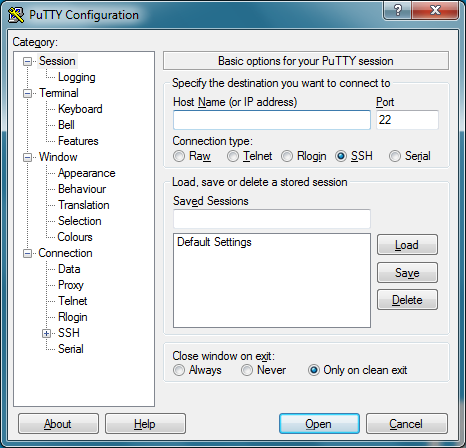

# Windows portable utils and apps

## ✋ AltDrag

Move and resize windows without cherry-picking borders and corners \(similar to some Linux distros\).



## 📝 Atom 

A powerful and highly customisable text editor, that can be used for development



## 🌏 Chromium

Internet browser





## 🩸 Colorpicker



## 🎥 HandBrake

Convert and resize video files.



## 🎮 JoyToKey

Automate mouse and keyboard actions using a gamepad \(or anything that behaves as a HID gamepad\)



## 📏 JRuler

Floating for pixels measurements on the screen



## 📼 KdenLive

Linear video editing and post-production tool.



## 📹 Logitech C920 Webcam Control

Tool to control Logitech C920/C920E settings as Zoom, Pan, Brightness, Contrast, Saturation and White Balance. This is an original Logitech software.



#### How to make it portable

This presumes your camera is working with Windows native drivers. If you need to install drivers too, this is not what you are looking for. 

1. Scroll all the way down and download the [version LWS 2.80 \(or just click here\)](http://www.logitech.com/pub/video/lws/lws280.exe)
2. Unpack the file `lws280.exe` using the UniExtract app \(find it in this page\)
3. Inside the unpacked folder, find the file`SharedBin\LWS_SharedBin_Installer_x86.exe`
4. Unpack `LWS_SharedBin_Installer_x86.exe` , and it will give you the folder with the portable app.
5. Run the file `LogiDPPApp.exe` to start the app.

## 📺 OBS \(Open Broadcaster Software\)

Tool for managing live compositions of video, pictures and various captures \(screen, camera, audio, mic\). It allows recording and keyboard shortcuts for toggling various setups on the fly.



## 🎨 Paint.NET

Powerful and versatile image editor



#### How to make it portable

1. Get the installer \(paint.net.X.X.XX.install.exe\)
2. Rename it to ZIP and extract to a folder.
3. Find the file `PaintDotNet_x##.msi` \(depending on your system architecture\)
4. Extract this file to a folder using UniExtract \(you will find it in this page\)
5. Move the contents extracted from `PaintDotNet_x##.msi` to the folder where you extracted Paint.NET \(same place where PaintDotNet.exe is\), and replace files when asked.

## ⚡ Putty

SSH client



## 📼 Shotcut

Linear video editing and post-production tool.



## 👋 StrokeIt

Mouse gestures for Windows



## 📝Sublime Text

A powerful and highly customisable text editor, that can be used for development



## 💬 Telegram

Instant messaging client



## 📦 UniExtract2

Extract any kind of file, including Windows Installer packages. Very useful to get the portable binaries from installation packages.



## 📺 VLC Media Player \(VideoLan\)

Streaming client and multimedia player for various formats and medias.



## 🎵 Winamp

Streamig client and media player for various audio formats.

How to use it portable: Download the installer, rename it to .ZIP, extract



## 🤢 WinDirStat

Visualise disk usage and identify big folders and files

* Unpack the installer using Uniextract then run windirstat.exe



## 📂 Winscp

SFTP and FTP client

